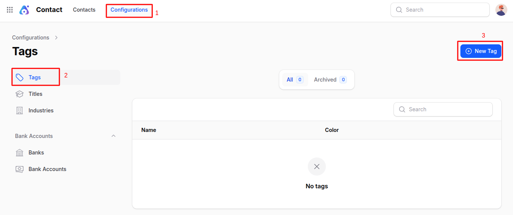
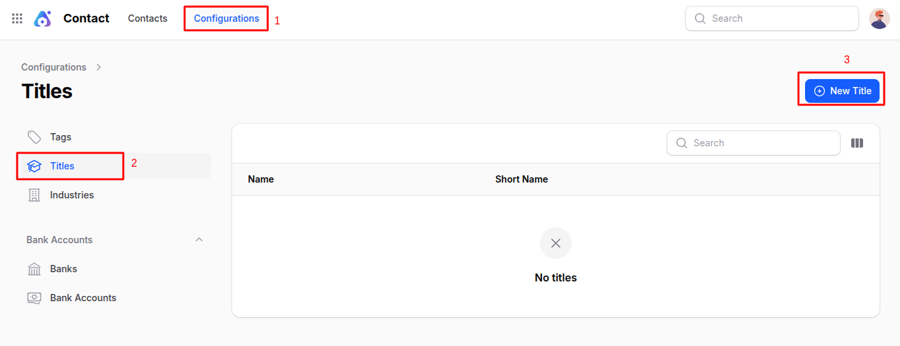
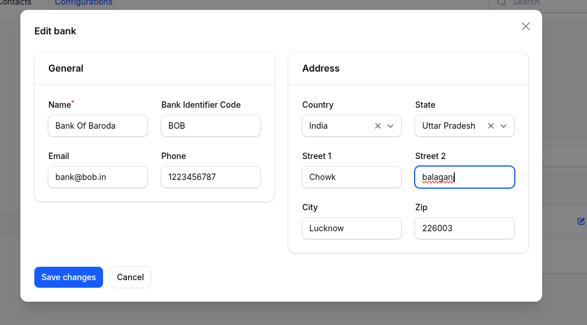
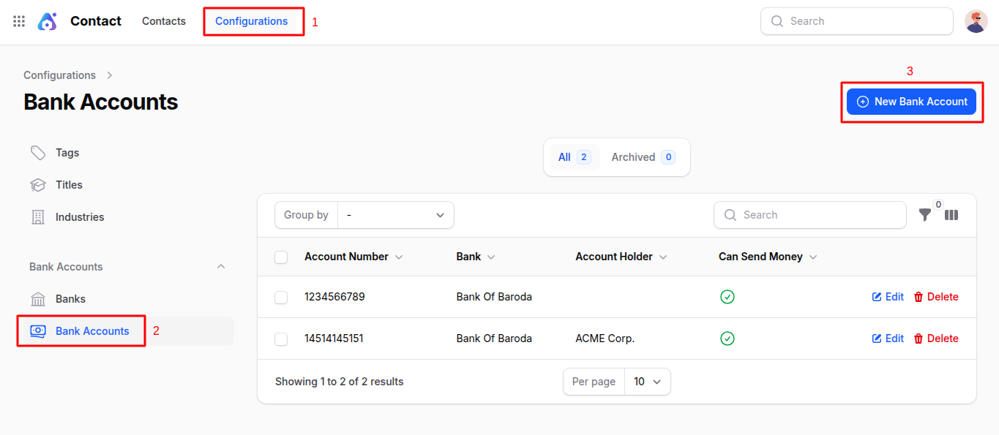
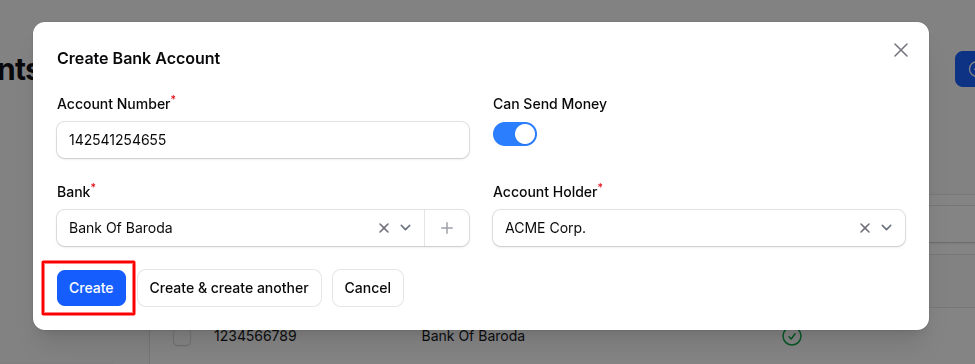

# Contacts Plugin Configuration

The **Contacts Plugin** in **AureusERP** allows you to manage all your customers, vendors, and their related details in one place. To make contact creation and management more efficient, it comes with several configurable options. These options help standardize entries and speed up the data input process during contact creation.

This guide explains the key configurations available in the Contacts plugin and how to create them.

## Tags Configuration

> **Why it's used:** Tags are useful for categorizing contacts based on custom labels like "VIP", "Supplier", "Lead", etc.

### Steps to Create a New Tag:

1. Navigate to **`Contacts → Configurations → Tags → New Tag`** as shown in the below image.

   

2. A modal form appears with the following fields:

   - **_Name:_** Enter the name of the tag (e.g., Supplier, Important Client).
   - **_Color:_** Choose a color for better visual distinction on contact records.

3. Click **Create** to save the tag.

## Titles Configuration

> **Why it's used:** Titles are prefixes like Mr., Ms., Dr., etc., that help identify or address a contact respectfully.

### Steps to Create a New Title:

1. Navigate to **`Contacts → Configurations → Titles → New Title`** as shown in the below image.

   

2. A modal form opens with these fields:

   - **_Name:_** Full title (e.g., Doctor, Mister).
   - **_Short Name:_** Abbreviation (e.g., Dr., Mr.).

3. Click **Create** to add the title to your system.

## Industry Configuration

> **Why it's used:** Industries help classify companies based on their business domain (e.g., IT, Retail, Healthcare).

### Steps to Create a New Industry:

1. Navigate to **`Contacts → Configurations → Industry → New Industry`** as shown in the below image.

   

2. A modal form appears with:

   - **_Name:_** Short name or abbreviation of the industry.
   - **_Full Name:_** Complete description of the industry.

3. Click **Create** to save.

## Banks Configuration

> **Why it's used:** Banks are useful to store bank details when associating them with contacts or during payment operations.

### Steps to Create a New Bank:

1. Navigate to **`Contacts → Configurations → Banks → New Bank`** as shown in the below image.

   

2. A form with the following sections appears:

   ### General Section

   - **_Name:_** Bank name (e.g., ICICI, HDFC).
   - **_Bank Identifier Code:_** Unique identifier for the bank (like SWIFT/BIC).
   - **_Email:_** Official contact email of the bank.
   - **_Phone:_** Contact number of the bank.

   ### Address Section

   - **_Country:_** Country where the bank is located.
   - **_State:_** State/Province.
   - **_Street:_** Street name or number.
   - **_City:_** City name.
   - **_Zip:_** Postal/ZIP code.

3. Click **Create** to add the bank.

## Bank Accounts Configuration

> **Why it's used:** Bank accounts are linked to contacts or companies for financial transactions.

### Steps to Create a New Bank Account:

1. Navigate to **`Contacts → Configurations → Bank Accounts → New Bank Account`** as shown in the below image.

   

2. A modal form appears with these fields:

   - **_Account Number:_** Enter the full bank account number.
   - **_Can Send Money:_** Toggle ON if the account can be used for outgoing payments.
   - **_Bank:_** Select the bank this account belongs to.
   - **_Account Holder:_** Name of the account holder.

3. Click **Create** to save the new bank account.

## Summary

The **Contacts Plugin** in **AureusERP** offers a unified system for managing all business relationships customers, vendors, or internal users. With sections for general info, contacts, and addresses, it's easy to keep data organized and up-to-date.
