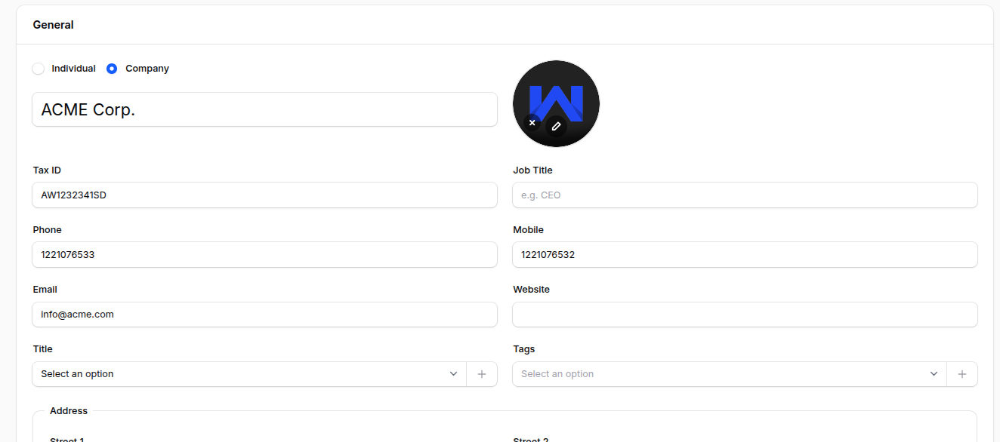
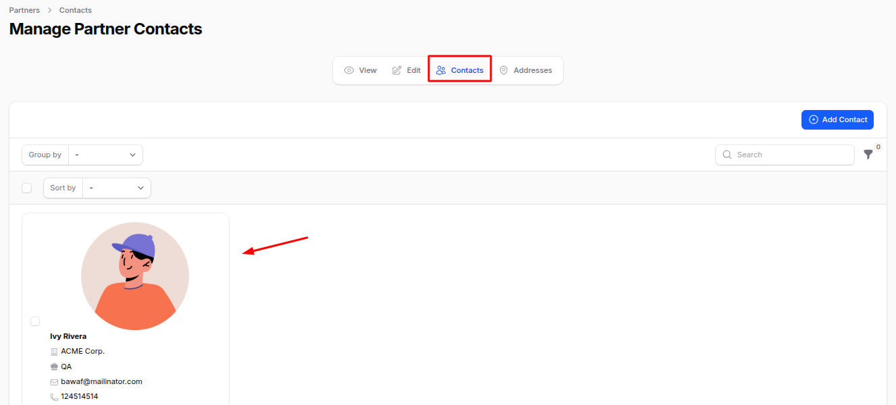

# Contacts

The **Contacts** plugin in **AureusERP** helps you manage all types of business contacts in one place including customers, vendors, users, and companies. It centralizes contact management and allows you to store important details like addresses, communication info, company affiliations, and more.

## Contact Creation

### Steps to Create a Contact

1. Navigate to **`Contacts → Contacts → Create Contact`** as shown in the below image.

   

2. Fill out the form with the following details:

   ### General Section

   - **_Individual or Company:_** Toggle between an individual or company. If you select **Company**, the **Company** field will hide to avoid duplication.
   - **_Name:_** Full name of the person or primary contact.
   - **_Company:_** Choose or create a company if the contact is affiliated with a business.
   - **_Tax ID:_** Enter the Tax Identification Number for legal or invoicing purposes.
   - **_Job Title:_** Job role or designation.
   - **_Phone:_** Landline or office phone number.
   - **_Mobile:_** Personal or direct contact number.
   - **_Email:_** Email address for communication.
   - **_Website:_** Enter the contact's or company's official website.
   - **_Title:_** Prefix such as Mr., Mrs., Dr., etc.
   - **_Tags:_** Labels or categories to organize contacts better.
   - **_Address:_** Fill in full address details including street, city, zip code, state, and country.

   

   ### Sales and Purchase Section

   - **Sales Subsection**

     - **_Responsible:_** Assign a user who manages this contact (e.g., account manager).

   - **Others Subsection**

     - **_Company ID:_** Internal tracking code or reference.
     - **_Reference:_** Optional code for cross-referencing.
     - **_Industry:_** Select the business sector this contact belongs to.

   

3. Action Buttons:

- **_Create:_** Save and finish creating the contact.
- **_Create & Create Another:_** Save and open a new contact form.
- **_Cancel:_** Exit without saving.

## After Creating a Contact

Click **Create** to save the contact. You'll be redirected to the **View Partner** page.

### Edit Partner

You can edit or update any of the contact's information by clicking the **Edit Partner** button. This is helpful for future updates or correcting data.

## Manage Contacts Tab

- Go to the **Contacts** tab on the View Partner page.
- Click **Add Contact** to open a modal form.
- The modal includes similar fields as the main contact creation page.

This allows you to:

- Add multiple representatives or staff members for a business contact.
- Store different contact roles (salesperson, support, billing, etc.).

> 📌 **Use Case:** Useful for organizations that need to store multiple points of contact under one company.

## Manage Addresses Tab

- Go to the **Address** tab on the View Partner page.
- Click **Add Address** to open a modal form.

### Address Modal Includes:

- **_Types:_** Choose the address type—Permanent, Present, Invoice, Delivery, or Other.
- **_Fields:_** Fill in details like name, email, phone, mobile, and complete address.

This structure ensures that all address-related information is properly categorized and easily accessible.

## Summary

The **Contacts Plugin** in AureusERP offers a unified system for managing all business relationships customers, vendors, or internal users. With sections for general info, contacts, and addresses, it's easy to keep data organized and up-to-date.
