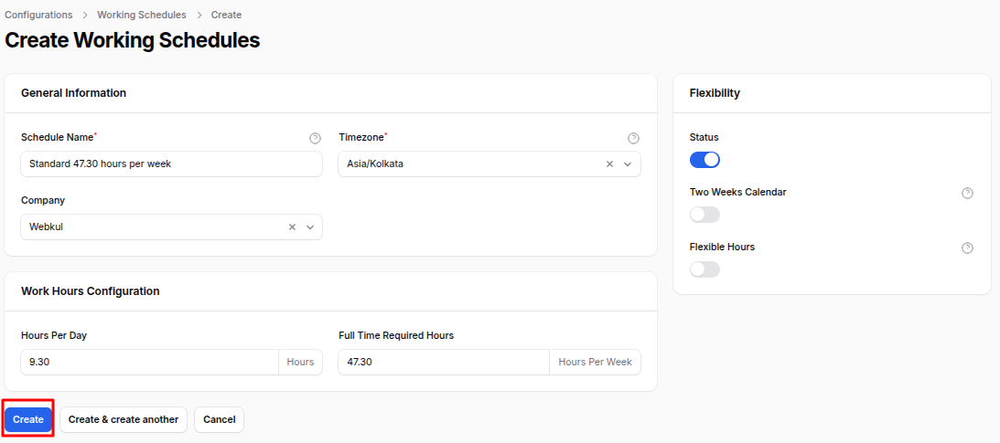
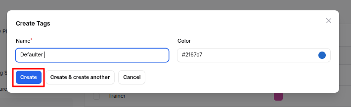
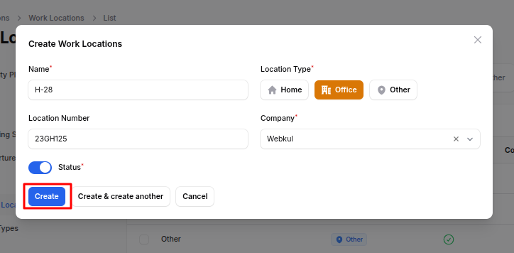
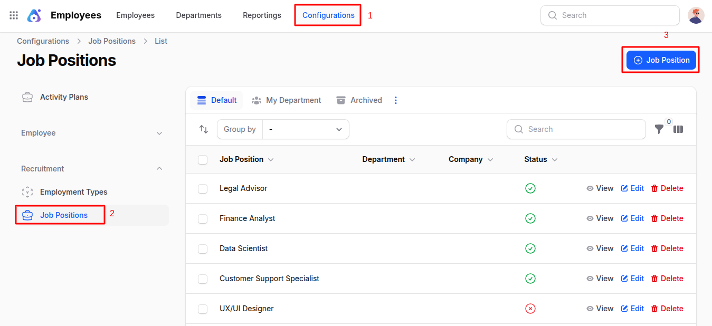

# Configuration

The **Employees Plugin** in **AureusERP** allows companies to manage workforce data efficiently, including job positions, working hours, employment types, and skills. Configuration options in this module help tailor employee-related processes to match the organization's structure and policies.

## Configuration Overview

Configurations are essential for customizing how employee records, work schedules, job roles, and skills are created and managed. These settings are used across employee profiles, job positions, and during recruitment or performance tracking.

## Activity Plans

Activity Plans are predefined sets of tasks or interactions assigned to employees within specific departments or companies. They streamline repetitive actions like onboarding steps or periodic evaluations.

### Steps to Create an Activity Plan

1. Navigate to **`Employees → Configurations → Activity Plans → New Activity Plan`** as shown below.

   

2. Fill in the following fields:

   - **_Name:_** A title for the activity plan (e.g., Onboarding Plan, Monthly Check-In).
   - **_Department:_** Select or create the department this plan applies to.
   - **_Company:_** Select or create the relevant company.
   - **_Status:_** Enable or disable the plan.

   

3. Click **Create** or **Create & Create Another**.

## Working Schedules

Working Schedules define employee work hours, days, and flexibility options. Useful for managing attendance, timesheets, and compliance.

### Steps to Create a Working Schedule

1. Navigate to **`Employees → Configurations → Working Schedules → New Working Schedule`** as shown below.

   

2. Fill in:

   ### General Information

   - **_Schedule Name:_** A name for the schedule (e.g., Standard 9-5, Night Shift).
   - **_Timezone:_** Select the time zone where this schedule applies.
   - **_Company:_** Assign to a specific company.

   ### Work Hours Configuration

   - **_Hours Per Day:_** Define daily working hours.
   - **_Full Time Required Hours:_** Weekly hours required for full-time status.

   ### Flexibility Options

   - **_Status (Toggle):_** Activate the schedule.
   - **_Two Weeks Calendar:_** Enable alternating week schedules.
   - **_Flexible Hours:_** Allow employees to work flexible hours.

   

3. Click **Create** or **Create & Create Another**.

## Departure Reasons

Departure Reasons are recorded when an employee leaves the company, helping with exit analysis and compliance.

### Steps to Create a Departure Reason

1. Navigate to **`Employees → Configurations → Departure Reasons → New Departure Reason`** as shown below.

   

2. Enter **Name** (e.g., Resignation, Retirement, Termination).

   

3. Click **Create** or **Create & Create Another**.

## Tags

Tags help categorize employees for quick filtering (e.g., Remote, Full-Time, Manager).

### Steps to Create a Tag

1. Navigate to **`Employees → Configurations → Tags → New Tag`** as shown below.

   

2. Enter:

   - **Name:** Tag label.
   - **Color:** Assign a color to visually distinguish the tag.

   

3. Click **Create** or **Create & Create Another**.

## Work Locations

Work Locations specify where employees perform their duties, supporting location-based reporting and resource planning.

### Steps to Create a Work Location

1. Navigate to **`Employees → Configurations → Work Locations → New Work Location`** as shown below.

   

2. Enter:

   - **_Name:_** Location title (e.g., Head Office, Remote).
   - **_Location Type:_** Choose **Home**, **Office**, or **Other**.
   - **_Location Number:_** Internal location reference code.
   - **_Company:_** Select the associated company.
   - **_Status:_** Enable/disable the location.

   

3. Click **Create** or **Create & Create Another**.

## Skill Types

Skill Types group various skills to track employee expertise. For example, "Programming" could be a type with skills like Python, Java.

### Steps to Create a Skill Type

1. Navigate to **`Employees → Configurations → Skill Types → New Skill Type`** as shown below.

   

2. Enter:

   - **_Name:_** Skill type (e.g., Programming).
   - **_Color:_** For easy identification.
   - **_Status (Toggle):_** Enable/disable this type.

   

3. Click **Create**.

### Add Skills to Skill Type

- On the **Edit Skill Type** page:
  

  - Click **New Skill** > enter **Name** > **Create**.
    
  - Click **New Skill Level** > fill in:

    - **Name**
    - **Level** (e.g., Beginner, Expert)
    - **Default Level (Toggle)**
    - Click **Create**.

    

## Employment Types

Employment Types define job nature like Full-Time, Part-Time, Internship.

### Steps to Create an Employment Type

1. Navigate to **`Employees → Configurations → Employment Types → New Employment Type`** as shown below.

   

2. Enter:

   - **_Employment Type:_** Label (e.g., Full-Time).
   - **_Country:_** Applicable region.

   

3. Click **Create** or **Create & Create Another**.

## Job Positions

Job Positions represent roles within the organization (e.g., Software Developer, HR Manager). These are used in employee and recruitment modules.

### Steps to Create a Job Position

1. Navigate to **`Employees → Configurations → Job Positions → New Job Position`** as shown below.

   

2. Fill in:

   ### Employment Information

   - **_Job Position Title:_** Name of the role.
   - **_Department:_** Assign or create new department.
   - **_Country:_** Location of the job.
   - **_Job Description:_** Duties and responsibilities.
   - **_Job Requirements:_** Skills and qualifications.
   - **_Recruitment Target:_** Number of employees to hire.
   - **_Employment Type:_** Select employment type.
   - **_Status (Toggle):_** Enable/disable the job position.

     

3. Click **Create** or **Create & Create Another**.

> These configuration settings ensure that your **Employees Plugin** is set up accurately, supporting HR operations like hiring, managing, and retaining talent within AureusERP.
