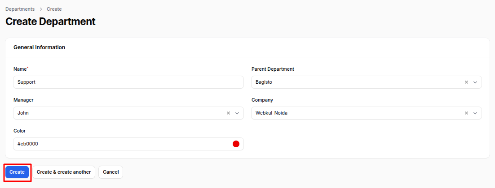

# Departments

The **Departments** feature in the **Employees** plugin of **AureusERP** allows an organization to manage and organize its workforce into logical units or teams. Departments help streamline employee management, reporting, and approvals. Each department can have a manager, a parent department (for hierarchy), and be associated with a specific company.

## Department Creation

### Steps to Create a New Department

1. Navigate to **Employees >> Departments >> New Department** as shown below.

2. Fill in the following details in the form:

   ### General Information

   - **Name:** Enter the name of the department (e.g., Sales, HR, Marketing, IT Support).

   - **Parent Department:** Select a parent department if this department falls under a larger department or division. Helps in building a hierarchical structure within the organization.

   - **Manager:** Assign an employee who will be responsible for managing this department. This person will handle team approvals and reports.

   - **Company:** Select the company this department belongs to (useful if your organization has multiple companies or branches).

   - **Color:** Choose a color to visually differentiate this department in charts, calendars, or reports. Helps in quickly identifying departments.

   

3. Actions Button

- **Create:** Save and create the department.
- **Create & Create Another:** Save the current department and open a new form to add another department.
- **Cancel:** Exit without saving.

## Use Case Example

> **Scenario:** A company named "TechFusion Ltd." has multiple teams like Software Development, QA, Sales, and Support. To manage them efficiently, each is set up as a department. The Sales department reports to the "Business Development" parent department, and each has its own manager for approvals and performance tracking.

Departments help ensure organized reporting, better task allocation, and structured approvals within AureusERP.

---
