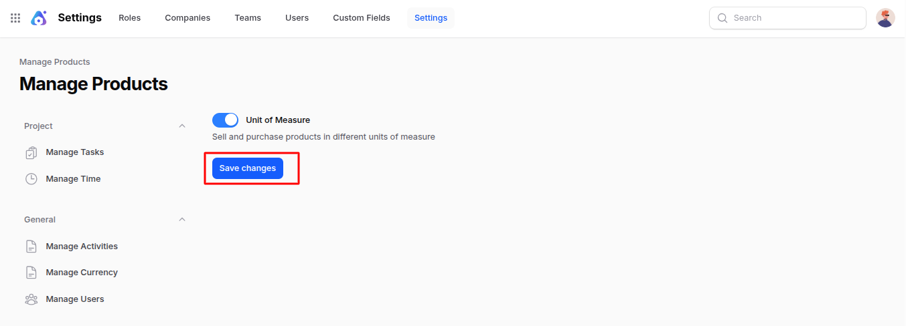

# Settings

The **Settings** section allows you to configure and manage important options for your Invoice module.

It helps control how products are handled, displayed, and sold within invoices.

## Manage Products

This section lets you define how products behave when creating invoices, including unit measurement preferences.

### Steps to Access

Navigate to **`Invoices → Settings → Manage Products`** as shown below:

### Field Descriptions

- **_Unit of Measure (Toggle):_**  
  Enable or disable the ability to sell and purchase products in different units of measure.
  - When **enabled**, you can select the unit (e.g., pieces, boxes, dozens) for each product directly within the invoice.
  - When **disabled**, products will only be sold in their default unit of measure.

**Example:**  
If you enable this option, you can sell one product either as 1 **unit** or as **1 dozen**, depending on the customer’s requirement.

### Action Button

- **_Save Changes:_**  
  After updating your settings, click **Save Changes** to apply and store your configurations.

### Summary

The **Manage Products** setting provides flexibility in handling product quantities by enabling multiple **Units of Measure (UoM)** for invoicing.  
This ensures accurate pricing and convenience when dealing with products sold in various quantities or packaging types.
