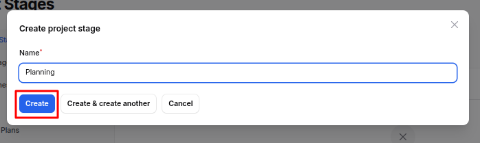
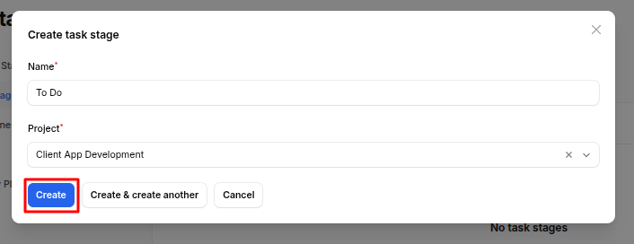
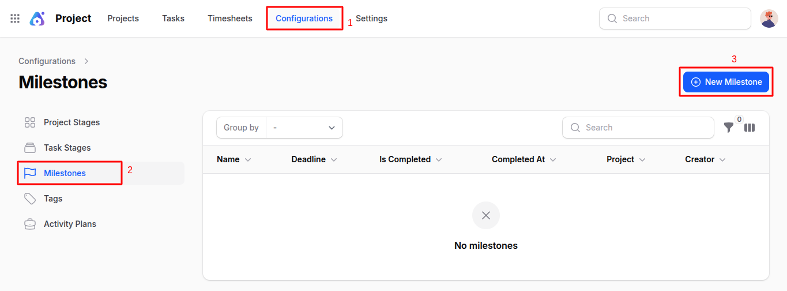
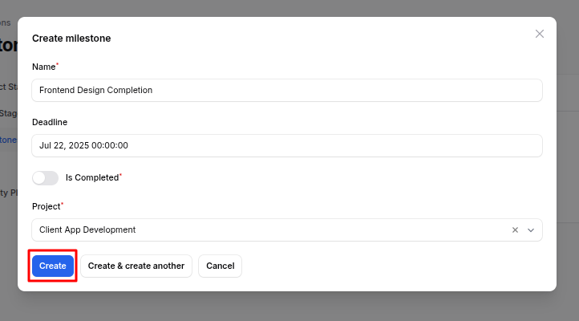
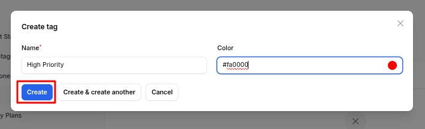

# Configuration

Configurations are a vital part of the **Project Plugin** in **AureusERP**. They help define workflows, organize tasks, and manage various elements efficiently. These configurations directly influence project and task creation, progress tracking, and activity planning. Below is a detailed guide for each configuration section.

## Project Stages

> **Why it's used:** Project stages represent the lifecycle or progression steps of a project. They help in tracking where the project currently stands (e.g., Planning, In Progress, Completed).

### Project Stages Creation

1. Navigate to **`Project → Configurations → Project Stages`** as shown in the below image.

   

2. A modal appears with a single field:

   - **Name**: Enter the name of the stage (e.g., Planning, Review, Completed)

   - Click **Create** to save the stage.
     
     > 📌 **Use case:** Use project stages to visually manage and track the current state of any project across your organization.

## Task Stages

> **Why it's used:** Task stages define the steps or statuses a task moves through during its lifecycle within a specific project.

### Task Stages Creation

1. Navigate to **`Project → Configurations → Task Stages`** as shown in the below image.

   

2. A modal appears with the following fields:

   - **Name**: Enter the name of the stage (e.g., Backlog, In Review)
   - **Project**: Select the related project from the dropdown

   - Click **Create** to save the task stage.
     
     > 📌 **Use case:** While managing tasks, using stages like "To Do," "In Progress," or "Done" helps you and your team track task progress more clearly.

## Milestones

> **Why it's used:** Milestones are key goals or checkpoints within a project that indicate significant progress.

### Milestone Creation

1. Navigate to **`Project → Configurations → Milestones`** as shown in the below image.

   

2. A modal appears with the following fields:

   - **Name:** Title of the milestone (e.g., MVP Delivery)
   - **Deadline:** Target date for the milestone
   - **Is Completed:** Toggle to mark the milestone as done
   - **Project:** Select the associated project

   - Click **Create** to add the milestone.
     
     > 📌 **Use Case:** Use milestones to track important events such as "Phase 1 Complete" or "Client Review Delivered." This keeps stakeholders aligned and helps in project planning.

## Tags

> **Why it's used:** Tags are labels that help in categorizing and grouping tasks and projects for better visibility and filtering.

### Tag Creation

1. Navigate to **`Project → Configurations → Tags`** as shown in the below image.

   

2. A modal appears with the following fields:

   - **Name**: Enter tag title (e.g., High Priority)
   - **Color**: Choose a tag color to visually differentiate tags

   - Click **Create** to save the tag.
     
     > 📌 **Use Case:** Apply tags such as "Urgent," "Design," or "High Priority" to quickly identify related items across the system.

## Activity Plans

> **Why it's used:** Activity Plans define structured task plans that outline what needs to be done within a project.

### Activity Plan Creation

1. Navigate to **`Project → Configurations → Activity Plans`** as shown in the below image.

   

2. A modal appears with the following fields:

   - **Name**: Give your activity plan a meaningful name (e.g., Onboarding Plan)
   - **Status**: Enter a default status or step within the activity plan

   - Click **Create** to save the plan.
     
     > 📌 **Use Case:** Use Activity Plans to organize routine operations or specific workflows. For example, an onboarding process could have its own activity plan.

## Summary

The **Project Configurations** in AureusERP are essential for customizing and optimizing project management workflows. By defining **Project Stages**, **Task Stages**, **Milestones**, **Tags**, and **Activity Plans**, organizations can enhance their ability to track progress, categorize tasks, and manage projects effectively. These configurations provide a structured approach to project management, ensuring clarity and efficiency for teams working within AureusERP.
