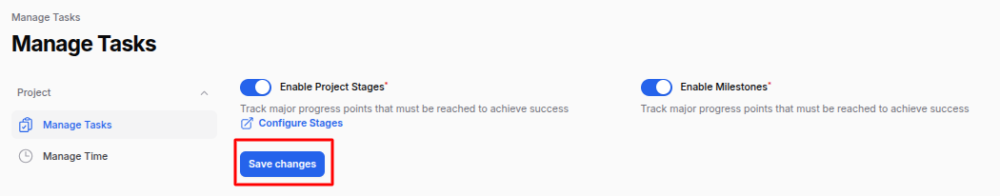
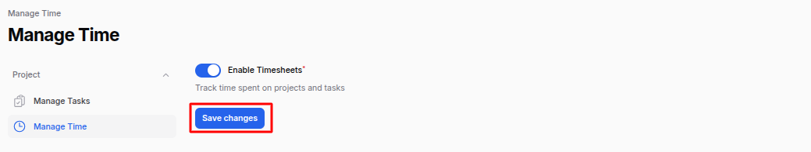
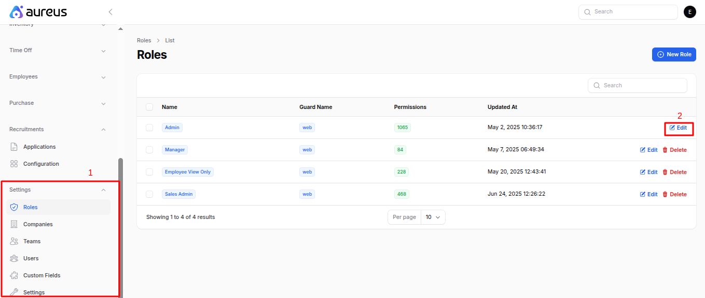

# Project Settings

The **Project Plugin Settings** in AureusERP allow you to customize how projects, tasks, and time tracking work within the system. These settings ensure that project-related features are tailored to your team's workflow.

## Manage Tasks Settings

1. Navigate to **Project >> Settings >> Manage Tasks**

   

   ### Available Options:

   - **Enable Project Stages (Toggle):**

     - Turn this ON to display **Project Stages** while creating a project.
     - This helps organize the project lifecycle into different stages such as Planning, Execution, Completed, etc.

   - **Enable Milestones (Toggle):**

     - Turn this ON to enable **Milestone Tracking** in the project creation process.
     - Milestones help you break large projects into manageable chunks with deadlines.

   Click **Save Changes** to apply your preferences.

   

   > Enabling both toggles will enhance your project planning and tracking capabilities by making **Stages** and **Milestones** visible during project creation.

## Manage Time Settings

1. Navigate to **Project >> Settings >> Manage Time**

   

   ### Available Option:

   - **Enable Timesheets (Toggle):**

     - Turn this ON to allow time tracking (timesheets) for tasks under each project.
     - This is useful for monitoring how much time is being spent on each task or phase.

   Click **Save Changes** to apply your preference.

   

   > When enabled, you’ll see the **Timesheet Option** while creating or editing a project, making time tracking easier and more integrated.

## Roles and Permissions for Project

To control who can access and manage features in the Project Plugin, configure roles and permissions properly.

1. Navigate to **Settings >> Roles & Permissions >> Edit Role (e.g., Project Manager)** as shown in the below image.

2. Under the **Project Plugin** section, you will see the following resources:
   - **Project Stage**
   - **Task Stage**
   - **Milestones**

### Available Actions:

For each resource, you can enable the following permissions:

- **View**
- **View Any**
- **Create**
- **Update**
- **Restore / Restore Any**
- **Replicate**
- **Reorder**
- **Delete / Delete Any**
- **Force Delete / Force Delete Any**

Enable these based on the role's responsibilities. For full functionality, enable **all relevant checkboxes**.

### Select All Shortcut:

- To quickly enable all permissions, use the **Select All** toggle at the top.
- This grants full access to both **Resources** and **Pages** under the plugin.

> **Note:** To use all features of the **Project Plugin**, make sure the relevant checkboxes are enabled for each user role.

---

By configuring these settings and permissions properly, your team can efficiently manage project workflows, assign tasks, track time, and ensure accountability across all project phases.
