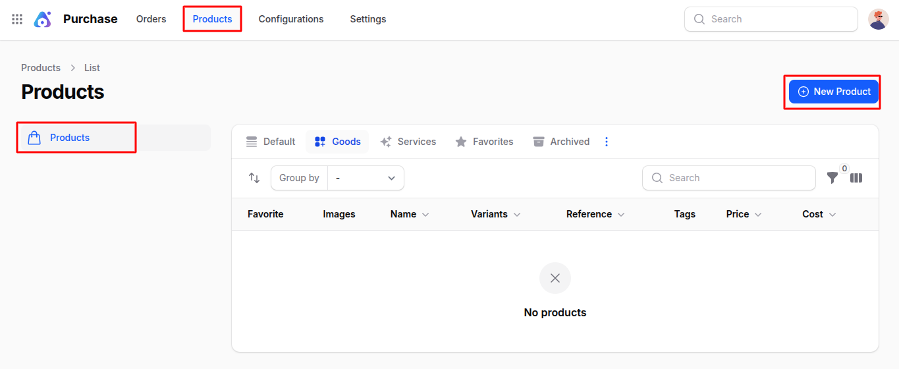
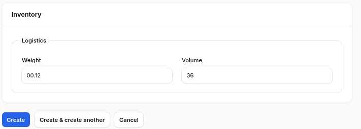
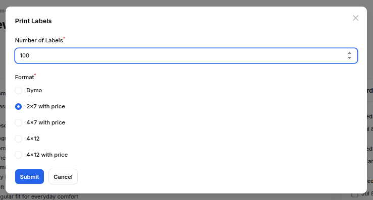
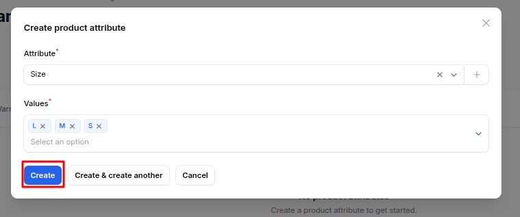
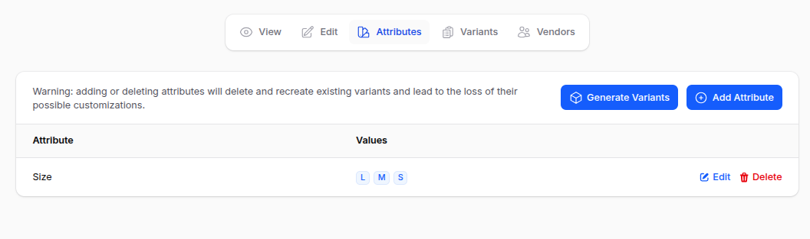
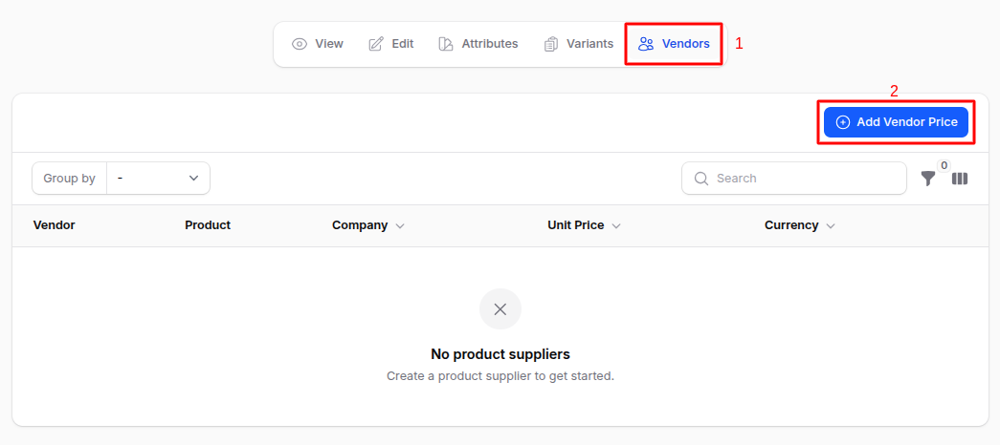

# Product

The **Products** module in the **Purchases** plugin of **AureusERP** allows procurement teams to manage goods and services they procure from vendors. It supports detailed tracking of vendor-specific information such as product pricing, lead times, product codes, and discount structures.

## Product Creation

### Steps to Create a Product

1. Navigate to **`Purchases → Products → Products → Create Product`** as shown in the below image.

   

2. Fill out the form with the following fields:

   ### Basic Details

   - **_Name:_** Enter the product or service name.
   - **_Description:_** Add optional product details or notes.
   - **_Images:_** Upload product images as needed.
   - **_Tags:_** Select from existing tags or create new ones to classify the product.
     

   ### Settings

   - **Type:** Choose from the following options:
   - **_Type:_** Choose from the following options:
     - _Goods_
     - _Service_
       > 🛈 Selecting **Goods** reveals the **Inventory** section.

   ### Inventory _(Visible if 'Goods' is selected)_

   

   - **_Reference:_** Product reference code.
   - **_Barcode:_** Product barcode.
   - **_Category\*:_**
     - Select from existing product categories or click ➕ to create one.
   - **_Company:_** Assign the product to a specific company.

   

   ### Pricing

   - **_Price:_** The retail price of the product.
   - **_Cost:_** The cost of the product from the vendor.

   

3. Action Buttons

- **_Create:_** Save and finish product creation.
- **_Create & Create Another:_** Save and open a new product form.
- **_Cancel:_** Exit without saving.

## After Product Creation

After clicking **Create**, you will be redirected to the **View Product** page.

Here you can manage:

- **Print Labels:**
  - Opens a modal with the following fields:
    - **_Number of Labels:_** Enter number of labels to print.
    - **_Format:_** Choose label dimension and price inclusion (e.g., 2x7 with price, 4x12 without price).
      
  - Clicking **Submit** downloads a PDF of generated labels.

**Delete:** Permanently removes the product.

## Product Management

From the **View Product** page, you can also:

### Edit Product

Update product details.

### Attributes

- Clicking **Attributes** redirects to the **Manage Attributes** page.
- Click **Add Attribute** to open a modal:
  - **_Attribute:_** Dropdown to select or create new attribute.
  - **_Values:_** Enter the values associated with the selected attribute.
    
    > 🛈 Once created, **variants** for the selected attributes are generated automatically.

### Variants Management

Manage product variants with the following actions:

- **_View:_** See variant details.
- **_Edit:_** Update variant info.
- **_Delete:_** Remove specific variant.

### Manage Vendors for a Product

Click on the Vendors tab from the View Product page to see and manage the vendors who supply this product. This section lets you add vendor details like price, delivery time, and product codes used by the vendor.

> 📌 Purpose: This helps the purchase team keep track of which vendor offers what price, how fast they can deliver, and what name/code they use for the product.

#### Add Vendor Price

Click **Add Vendor** to open a modal form with the following fields:

- **_Vendor:_** Select a vendor from the registered list.
- **_Vendor Product Name:_** The vendor's product name will appear on the request for quotation. Leave blank to use the internal product name.
- **_Vendor Product Code:_** The vendor's product code will appear on the request for quotation. Leave blank to use the internal code.
- **_Delivery Lead Time (Days):_** The lead time from purchase order confirmation to product receipt in the warehouse.Used for scheduler for automatic purchase order planning.
- **_Product:_** Choose the product variant this price applies to.
- **_Quantity:_** Minimum quantity for which this pricing applies.
- **_Unit Price:_** Price offered by the vendor.
- **_Currency:_** Currency of transaction (e.g., USD, INR).
- **_Valid From:_** Start date for the pricing validity.
- **_Valid Until:_** Expiry date for the pricing.
- **_Discount (%):_** Discount offered by the vendor.
- **_Company:_** Company this vendor pricing is assigned to.

#### Use Case

Procurement teams can maintain vendor-wise price lists, identify cost-effective options, and track delivery lead times — all in one centralized location.

> 📌 **Purpose:** Maintain clarity and control over vendor relationships by tracking variant-specific costs, timelines, and vendor codes directly within the product record.

## Summary

Product management in the **Purchases** plugin of **AureusERP** ensures efficient procurement processes, cost control, and strong vendor relationships by centralizing all relevant product and vendor information.
