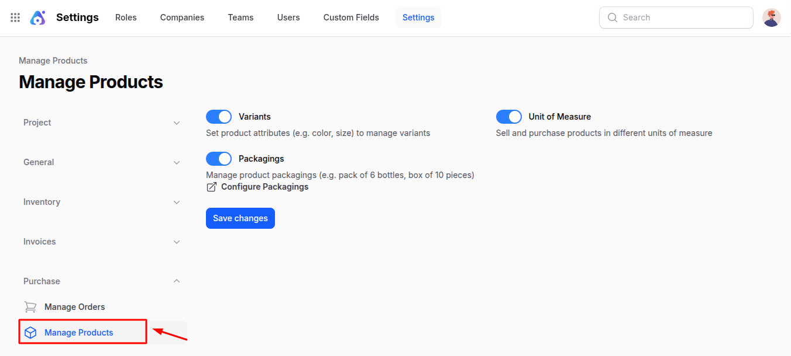

# Settings

The **Settings** section in the **Purchases** module allows you to control how purchase orders and product-related processes work in AureusERP.

These settings help you streamline approvals, order management, and product configuration according to your business needs.

## Manage Orders

This section helps you configure how purchase orders are created, approved, and managed.

### Steps to Access

1. Navigate to **`Purchase → Settings → Manage Orders`** as shown below:

2. You will see the following fields:

   - **_Purchase Order Approval:_** When enabled, purchase orders exceeding a specific **minimum amount** will require approval from a manager before confirmation. This ensures better control over high-value purchases.

   - **_Minimum Amount:_** Define the threshold amount for which a purchase order must be approved.  
     Example: If set to ₹10,000, any order above this amount will need manager approval.

   - **_Lock Confirmed Orders:_** When enabled, once a purchase order is confirmed, it cannot be edited. This helps prevent accidental changes after finalization.

   - **_Purchase Agreements:_** Enable this option to manage **Blanket Orders** and **Purchase Templates**. Blanket Orders help in long-term agreements with suppliers, while Purchase Templates simplify repetitive order creation.

3. Action Button

   - **_Save Changes:_** Click this button to apply and save all your configuration updates.

## Manage Products

This section allows you to configure how products are managed and used in purchase orders.

### Steps to Access

1. Navigate to **`Purchase → Settings → Manage Products`** as shown below:

   

2. You will see the following fields:

   - **_Variants:_** Enable to manage products with multiple variations such as size, color, or material. This allows you to create and purchase specific product variants instead of a single general product.
   - **_Unit of Measure:_** Enable to buy and sell products in different measurement units (e.g., pieces, boxes, dozens). This provides flexibility for managing product quantities in various formats.
   - **_Packagings:_** Enable to manage product packaging details, such as a pack of 6 bottles or a box of 10 pieces. This helps in tracking inventory and purchases based on packaging type.

3. Action Button

   - **_Save Changes:_** Click this button to store your updated product management configurations.

### Summary

The **Purchases Settings** section ensures complete control over how orders and products are managed.  
By enabling or disabling options, you can:

- Require approval for high-value purchases
- Prevent edits after confirmation
- Manage product variants, units, and packaging options effectively

These settings enhance accuracy, security, and flexibility across your purchasing workflow in **AureusERP**.
