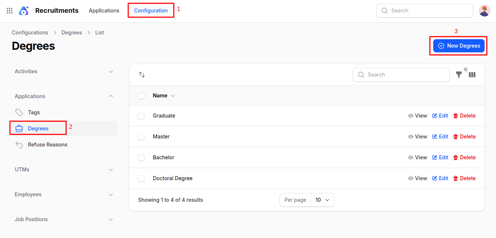
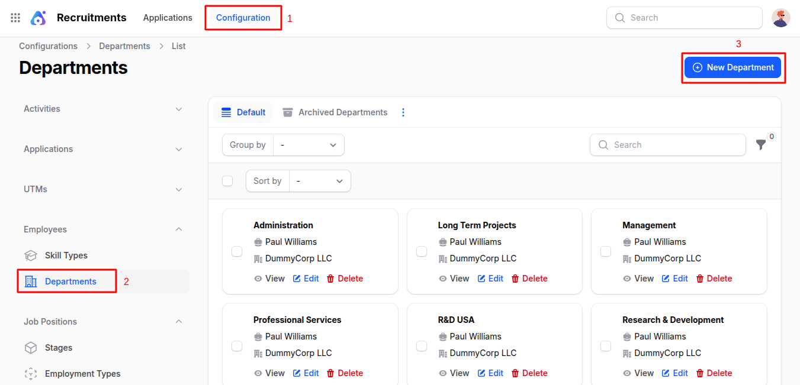
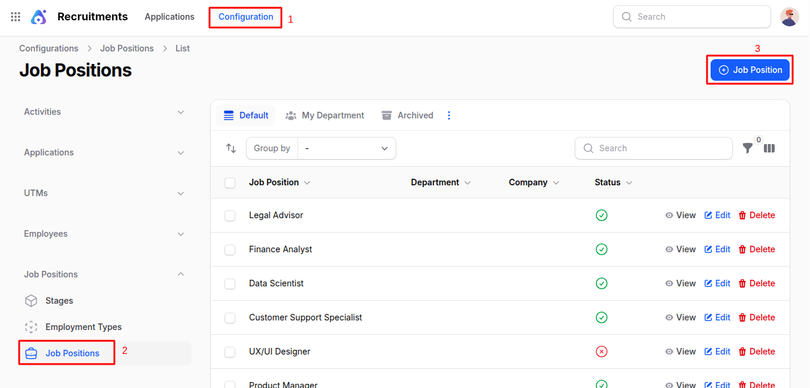

# Configuration

This document explains the **Configuration** section of the Recruitment Plugin in **AureusERP**. Configuration is crucial for setting up the hiring process, including job positions, applicants, and candidate evaluation. Below is a detailed explanation of each configurable item in simple and clear language.

## Activity Plans

Activity Plans help in planning and organizing steps in the recruitment process, such as initial screening, interviews, etc.

### Steps to Create

1. Navigate to **Recruitments >> Configuration >> Activities >> Activity Plans** as shown in the below image.

   

2. Fill in:

   - **Name**: Title of the activity plan (e.g., Initial Interview Plan)
   - **Department**: The department for which this plan is applicable
   - **Company**: The company where the recruitment is taking place
   - **Status**: Set whether the activity plan is active

3. Action Buttons
   Click **Create** , **Create & Create Another** or **Cancel**

## Activity Types

Define specific types of recruitment actions (e.g., phone call, meeting, upload documents).

### Steps to Create

1. Navigate to **Recruitments >> Configuration >> Activities >> Activity Types** as shown in the below image.

   

2. Fill in:

   ### General Information:

   - **_Activity Type:_** Select from existing types or define new
   - **_Action:_** Specify what action will be triggered (e.g., Open Form, Upload File)
   - **_Default User:_** Person assigned to handle this activity by default
   - **_Summary:_** Short description
   - **_Note:_** Additional details

   ### Advanced Information:

   - **_Icon:_** Visual icon to represent this activity
   - **_Decoration Type:_** Alert type (Alert/Error)
   - **_Chaining Type:_** Whether to suggest or trigger next activity automatically
   - **_Suggest/Trigger:_** Choose the next activity based on chaining type

   ### Status & Configuration:

   - **_Status:_** Whether this activity type is active
   - **_Keep Done Activities:_** Whether to keep record of completed ones

   ### Delay Information:

   - **Delay Count** and **Unit**: Set delays (e.g., 2 Days)
   - **_Delay From:_** Choose between previous deadline or completion date

## Tags

Tags help categorize applications (e.g., Urgent, Skilled, Fresher)

### Steps to Create

1. Navigate to **Recruitments >> Configuration >> Applications >> Tags** as shown in the below image.

   

2. Fill in:

   - **Name**
   - **Color** (for easy identification)

## Degrees

Define the academic qualifications applicable for a position.

### Steps to Create

1. Navigate to **Recruitments >> Configuration >> Applications >> Degrees** as shown in the below image.

   

2. Enter the **Name** (e.g., MBA, B.Tech)

## Refuse Reasons

Set predefined reasons for rejecting applicants.

### Steps to Create

1. Navigate to **Recruitments >> Configuration >> Applications >> Refuse Reasons** as shown in the below image.

   

2. Fill in:

   - **_Name:_** Reason (e.g., Lack of Experience)
   - **_Template:_** Select appropriate template (e.g., Applicant Refused, Not Interested)

## Mediums

Define marketing or application mediums (e.g., Social Media, Job Portal).

### Steps to Create

1. Navigate to **Recruitments >> Configuration >> UTMs >> Mediums** as shown in the below image.

   

2. Enter **Name** (e.g., LinkedIn, Indeed)

## Sources

Identify sources from where applicants are coming.

### Steps to Create

1. Navigate to **Recruitments >> Configuration >> UTMs >> Sources** as shown in the below image.

   

2. Enter **Name** (e.g., Referral, College Drive)

## Skill Types

Define skills required in employees (e.g., Programming, Communication).

### Steps to Create

1. Navigate to **Recruitments >> Configuration >> Employees >> Skill Types** as shown in the below image.

   

2. Fill in:

   - **Name**
   - **Color**
   - **Status:** Enable/Disable toggle

## Departments

Organize your company structure by departments (e.g., HR, Development).

### Steps to Create

1. Navigate to **Recruitments >> Configuration >> Employees >> Departments** as shown in the below image.

   

2. Fill in:

   - **Name**
   - **Parent Department:** (Optional)
   - **Manager**
   - **Company**
   - **Color:** Tag color

## Stages

Define steps in the recruitment pipeline (e.g., Applied, Interview, Hired).

### Steps to Create

1. Navigate to **Recruitments >> Configuration >> Job Positions >> Stages** as shown in the below image.

   

2. Fill in:

   ### General Information:

   - **_Stage Name:_** Name of the stage
   - **_Requirements Department:_** Related department

   ### Tooltips:

   - **_Gray/Red/Green Label:_** Custom tooltips for visual cues

   ### Additional Info:

   - **_Folded:_** Collapse this stage on Kanban
   - **_Hired Stage:_** Marks the stage as final
   - **_Default Stage:_** Set as initial stage

## Employment Types

Define job types like Full-Time, Part-Time, Internship.

### Steps to Create

1. Navigate to **Recruitments >> Configuration >> Job Positions >> Employment Types** as shown in the below image.

   

2. Fill in:

   - **Employment Type** (e.g., Internship)
   - **Country**

## Job Positions

Add and manage open positions in your organization.

### Steps to Create

1. Navigate to **Recruitments >> Configuration >> Job Positions >> Job Positions** as shown in the below image.

   

2. Fill in:

   ### Employment Information:

   - **_Job Position Title:_** Name of the job (e.g., Software Engineer)
   - **_Department:_** Choose from the list or create
   - **_Country:_** Job location country
   - **_Manager:_** Person responsible for this position
   - **_Company:_** Select the company
   - **_Recruiter:_** Recruiter responsible
   - **_Interviewers:_** Add interviewers
   - **_Job Location:_** Office location
   - **_Industry:_** Related industry
   - **_Job Description:_** Detailed job overview
   - **_Job Requirements:_** Required qualifications/skills
   - **_Date From / To:_** Recruitment duration
   - **_Recruitment Target:_** Number of people to recruit
   - **_No. of Employees:_** Existing count
   - **_Expected Employees:_** Planned employee count
   - **_No. of Hired Employees:_** Final count hired
   - **_Expected Skills:_** Skills needed (select from list)
   - **_Employment Type:_** Select from previously created types
   - **_Status:_** Toggle to enable/disable the position

---

This configuration ensures the recruitment process is smooth, structured, and aligned with organizational needs. Once set up, it empowers HR teams to streamline hiring workflows.
