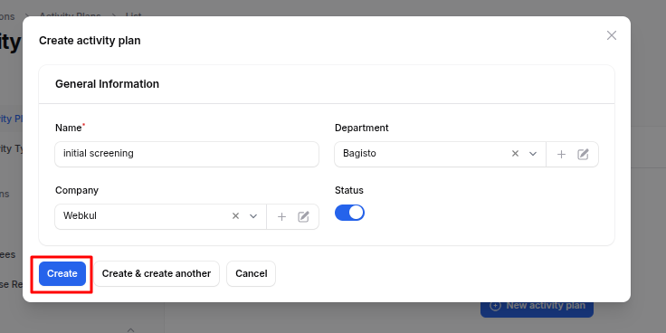
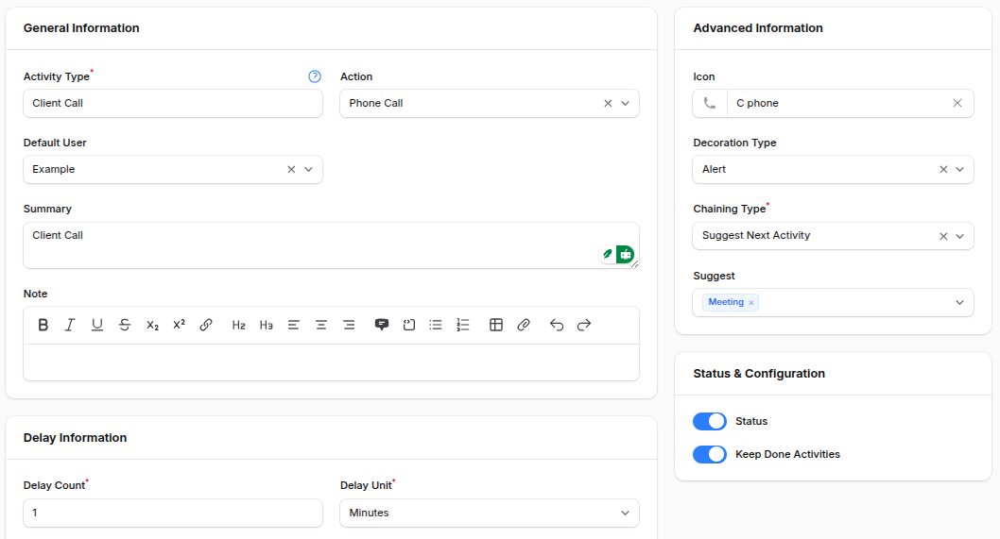
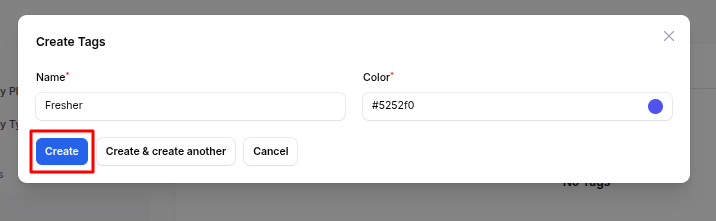
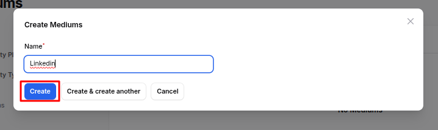
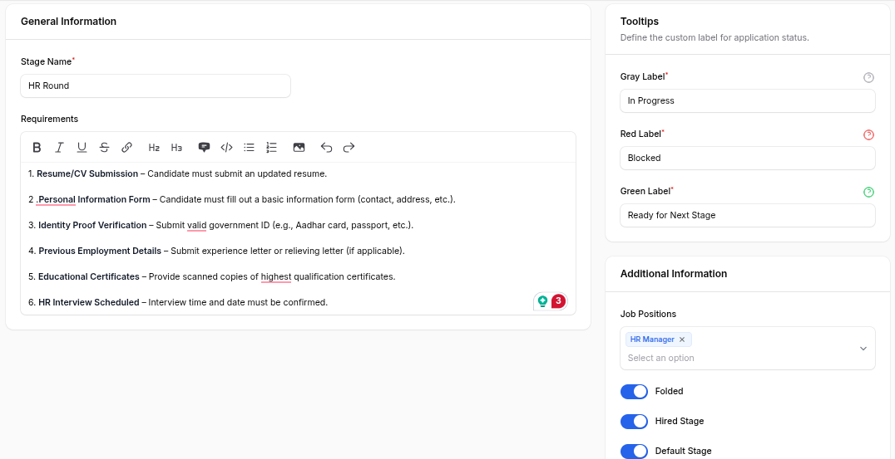
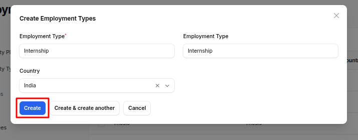

# Configuration

This document explains the **Configuration** section of the Recruitment Plugin in **AureusERP**. Configuration is crucial for setting up the hiring process, including job positions, applicants, and candidate evaluation. Below is a detailed explanation of each configurable item

## Activity Plans

> **Why it's used:** Activity Plans help in planning and organizing steps in the recruitment process, such as initial screening, interviews, etc.

### Activity Plan Creation

1. Navigate to **`Recruitments → Configuration → Activities → Activity Plans`** as shown in the below image.

   

2. Fill in:

   - **_Name:_** Title of the activity plan (e.g., Initial Interview Plan)
   - **_Department:_** The department for which this plan is applicable
   - **_Company:_** The company where the recruitment is taking place
   - **_Status:_** Set whether the activity plan is active

   

3. Action Buttons

   - **_Create:_** Save and create the activity plan.
   - **_Create & Create Another:_** Save and open a new form to add another activity
   - **_Cancel:_** Exit without saving.

## Activity Types

> **Why it's used:** Activity Types Define specific types of recruitment actions (e.g., phone call, meeting, upload documents).

### Activity Type Creation

1. Navigate to **`Recruitments → Configuration → Activities → Activity Types`** as shown in the below image.

   

2. Fill in:

   ### General Information:

   - **_Activity Type:_** Select from existing types or define new
   - **_Action:_** Specify what action will be triggered (e.g., Open Form, Upload File)
   - **_Default User:_** Person assigned to handle this activity by default
   - **_Summary:_** Short description
   - **_Note:_** Additional details

   ### Advanced Information:

   - **_Icon:_** Visual icon to represent this activity
   - **_Decoration Type:_** Alert type (Alert/Error)
   - **_Chaining Type:_** Whether to suggest or trigger next activity automatically
   - **_Suggest/Trigger:_** Choose the next activity based on chaining type

   ### Status & Configuration:

   - **_Status:_** Whether this activity type is active
   - **_Keep Done Activities:_** Whether to keep record of completed ones

   ### Delay Information:

   - **_Delay Count_** and **_Unit_**: Set delays (e.g., 2 Days)
   - **_Delay From:_** Choose between previous deadline or completion date

   

3. Action Buttons

   - **_Create:_** Save and create the activity type.
   - **_Create & Create Another:_** Save and open a new form to add another activity type.
   - **_Cancel:_** Exit without saving.

## Tags

> **Why it's used:** Tags help categorize applications (e.g., Urgent, Skilled, Fresher)

### Tag Creation

1. Navigate to **`Recruitments → Configuration → Applications → Tags`** as shown in the below image.

   

2. Fill in:

   - **_Name:_**
   - **_Color:_** (for easy identification)

   

3. Action Buttons

   - **_Create:_** Save and create the tag.
   - **_Create & Create Another:_** Save and open a new form to add another tag.
   - **_Cancel:_** Exit without saving.

## Degrees

> **Why it's used:** Define the academic qualifications applicable for a position.

### Degree Creation

1. Navigate to **`Recruitments → Configuration → Applications → Degrees`** as shown in the below image.

   

2. Enter the **_Name:_** (e.g., MBA, B.Tech)

   

3. Action Buttons

   - **_Create:_** Save and create the degree.
   - **_Create & Create Another:_** Save and open a new form to add another degree.
   - **_Cancel:_** Exit without saving.

## Refuse Reasons

> **Why it's used:** Set predefined reasons for rejecting applicants.

### Refuse Reason Creation

1. Navigate to **`Recruitments → Configuration → Applications → Refuse Reasons`** as shown in the below image.

   

2. Fill in:

   - **_Name:_** Reason (e.g., Lack of Experience)
   - **_Template:_** Select appropriate template (e.g., Applicant Refused, Not Interested)

   

3. Action Buttons

   - **_Create:_** Save and create the refuse reason.
   - **_Create & Create Another:_** Save and open a new form to add another refuse reason.
   - **_Cancel:_** Exit without saving.

## Mediums

> **Why it's used:** Define marketing or application mediums (e.g., Social Media, Job Portal).

### Medium Creation

1. Navigate to **`Recruitments → Configuration → UTMs → Mediums`** as shown in the below image.

   

2. Enter **_Name:_** (e.g., LinkedIn, Indeed)

   

3. Action Buttons

   - **_Create:_** Save and create the medium.
   - **_Create & Create Another:_** Save and open a new form to add another medium.
   - **_Cancel:_** Exit without saving.

## Sources

> **Why it's used:** Identify sources from where applicants are coming.

### Source Creation

1. Navigate to **`Recruitments → Configuration → UTMs → Sources`** as shown in the below image.

   

2. Enter **_Name:_** (e.g., Referral, College Drive)

   

3. Action Buttons

   - **_Create:_** Save and create the source.
   - **_Create & Create Another:_** Save and open a new form to add another source.
   - **_Cancel:_** Exit without saving.

## Skill Types

> **Why it's used:** Define skills required in employees (e.g., Programming, Communication).

### Skill Type Creation

1. Navigate to **`Recruitments → Configuration → Employees → Skill Types`** as shown in the below image.

   

2. Fill in:

   - **_Name:_**
   - **_Color:_**
   - **_Status:_** Enable/Disable toggle

   

3. Action Buttons

   - **_Create:_** Save and create the skill type.
   - **_Create & Create Another:_** Save and open a new form to add another skill type.
   - **_Cancel:_** Exit without saving.

## Departments

> **Why it's used:** Organize your company structure by departments (e.g., HR, Development).

### Department Creation

1. Navigate to **`Recruitments → Configuration → Employees → Departments`** as shown in the below image.

   

2. Fill in:

   - **_Name:_**
   - **_Parent Department:_** (Optional)
   - **_Manager:_**
   - **_Company:_**
   - **_Color:_:** Tag color

   

3. Action Buttons

   - **_Create:_** Save and create the department.
   - **_Create & Create Another:_** Save and open a new form to add another department.
   - **_Cancel:_** Exit without saving.

## Stages

> **Why it's used:** Define steps in the recruitment pipeline (e.g., Applied, Interview, Hired).

### Stage Creation

1. Navigate to **`Recruitments → Configuration → Job Positions → Stages`** as shown in the below image.

   

2. Fill in:

   ### General Information:

   - **_Stage Name:_** Name of the stage
   - **_Requirements Department:_** Related department

   ### Tooltips:

   - **_Gray/Red/Green Label:_** Custom tooltips for visual cues

   ### Additional Info:

   - **_Folded:_** Collapse this stage on Kanban
   - **_Hired Stage:_** Marks the stage as final
   - **_Default Stage:_** Set as initial stage

   

3. Action Buttons

   - **_Create:_** Save and create the stage.
   - **_Create & Create Another:_** Save and open a new form to add another stage.
   - **_Cancel:_** Exit without saving.

## Employment Types

> **Why it's used:** Define job types like Full-Time, Part-Time, Internship.

### Employment Type Creation

1. Navigate to **`Recruitments → Configuration → Job Positions → Employment Types`** as shown in the below image.

   

2. Fill in:

   - **_Employment Type:_** (e.g., Internship)
   - **_Country:_**

   

3. Action Buttons

   - **_Create:_** Save and create the employment type.
   - **_Create & Create Another:_** Save and open a new form to add another employment type.
   - **_Cancel:_** Exit without saving.

## Job Positions

> **Why it's used:** Add and manage open positions in your organization.

### Job Position Creation

1. Navigate to **`Recruitments → Configuration → Job Positions → Job Positions`** as shown in the below image.

   

2. Fill in:

   ### Employment Information:

   - **_Job Position Title:_** Name of the job (e.g., Software Engineer)
   - **_Department:_** Choose from the list or create
   - **_Country:_** Job location country
   - **_Manager:_** Person responsible for this position
   - **_Company:_** Select the company
   - **_Recruiter:_** Recruiter responsible
   - **_Interviewers:_** Add interviewers
   - **_Job Location:_** Office location
   - **_Industry:_** Related industry
   - **_Job Description:_** Detailed job overview
   - **_Job Requirements:_** Required qualifications/skills
   - **_Date From / To:_** Recruitment duration
   - **_Recruitment Target:_** Number of people to recruit
   - **_No. of Employees:_** Existing count
   - **_Expected Employees:_** Planned employee count
   - **_No. of Hired Employees:_** Final count hired
   - **_Expected Skills:_** Skills needed (select from list)
   - **_Employment Type:_** Select from previously created types
   - **_Status:_** Toggle to enable/disable the position

   

3. Action Buttons

   - **_Create:_** Save and create the job position.
   - **_Create & Create Another:_** Save and open a new form to add another job position.
   - **_Cancel:_** Exit without saving.

## Summary

The Configuration section of the **Recruitment** Plugin in **AureusERP** is essential for setting up a structured and efficient hiring process. Each configurable item includes detailed steps for creation, ensuring that HR teams can easily manage and customize their recruitment processes to meet organizational needs.
