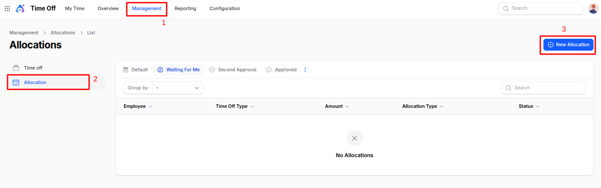
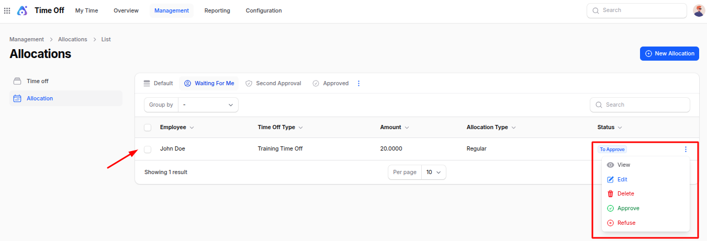

# Time Off Management

The **Management** section in the Time-Off plugin is designed for approvers or HR managers. From here, authorised users can **review** employee time-off requests and either **approve** or **refuse** them. Approvers can also create manual time-off records and allocate leave to employees when needed.

## Time Offs

The **Time-Offs** menu allows approvers to manually create time-off records for employees. This is useful when an employee is unable to submit a request on their own, or if HR needs to record leave on behalf of the employee.

The data grid also provides quick actions to approve or refuse submitted time-off requests.

### Steps to Create a Time Off Request

1. Go to **`Time Off → Management → Time Offs`** as shown in the below image.

   

2. Fill in the following fields:

   - **_Employee Name:_** Select the employee requesting time-off
   - **_Department Name:_** System auto-selects based on employee, or choose manually
   - **_Time Off Type:_** Select type of leave (Sick Leave, Casual, Paid Leave, etc.)
   - **_Request Date From / To:_** Start and end dates of leave
   - **_Half-Day:_** Enable if employee is taking only half-day leave
   - **_Duration:_** Total number of days (auto-calculated based on dates)
   - **_Description:_** Reason for requesting leave (e.g., medical leave, travel, etc.)

3. Action Buttons

   - **_Create:_** Submit and save the leave request
   - **_Create & Create Another:_** Submit and open new request form
   - **_Cancel:_** Close without saving

   

> Once submitted, the manager can **Approve or Refuse** from the list screen.

## Allocation

A **Time-Off Allocation** assigns leave days to employees.  
It could be given:

- **In advance** (e.g., 24 annual leaves per year)
- **Earned monthly** (e.g., accrual policy where employee earns 2 leaves/month)

### Use Case

- HR allocates **12 annual leave days** to each employee at the beginning of the year.
- Another example: employee earns **1.5 sick leave days every month** (accrual).

### Steps to Create Leave Allocation

1. Navigate to **`Time Off → Management → Allocations`** as shown in the below image.

   

2. Fill in the details:

   - **_Name:_** Title for the allocation (e.g., Annual Leave Allocation 2025)
   - **_Time Off Type:_** Select leave category (Annual, Sick, Maternity leave, etc.)
   - **_Employee Name:_** Assign leave days to a specific employee
   - **_Allocation Type:_** Choose leave method:  **Regular** – Assign full leave amount at once  **Accrual** – Leave earned gradually over time
   - **_Date From / To:_** Validity period when the leave balance can be used
   - **_Allocation (No. of Days):_** Number of leave days provided
   - **_Reason:_** Reason for providing allocation (policy, management request, etc.)

3. Action Buttons

   - **_Create:_** Submit the leave allocation
   - **_Create & Create Another:_** Save and open another form
   - **_Cancel:_** Exit without saving

   

> Just like time-off requests, leave allocations also support **Approve / Refuse** actions.

### Summary

The **Management** section allows approvers to review and take action on employee time-off requests, create leave entries, and allocate leave balances ensuring accurate and smooth time-off management.
